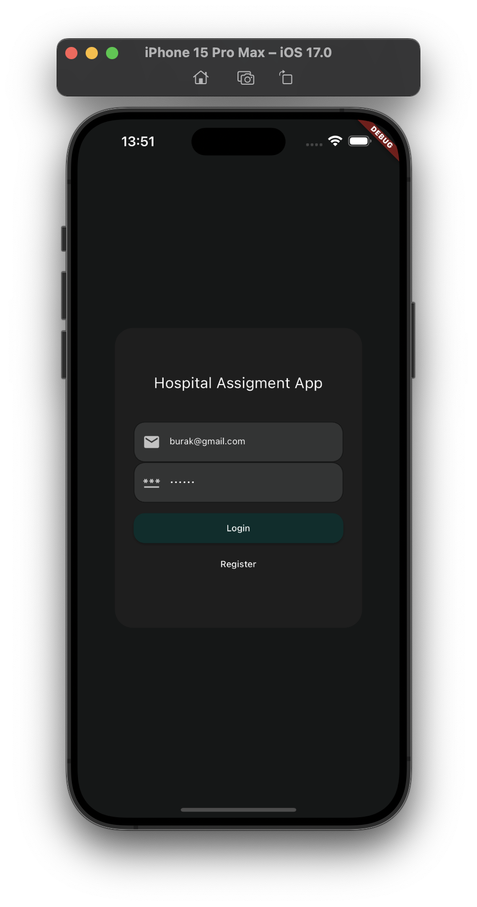
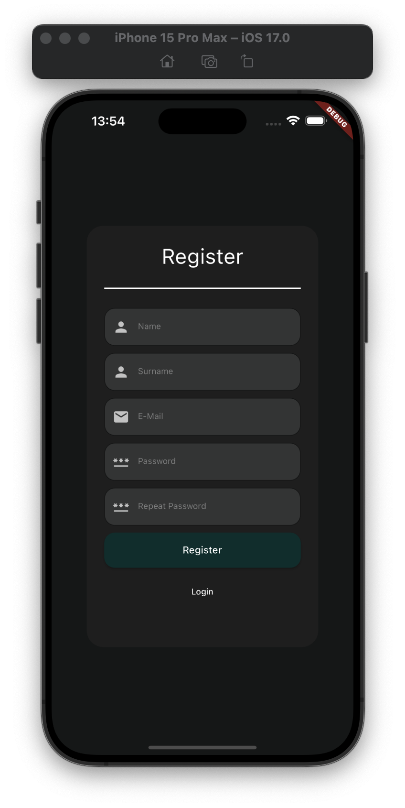
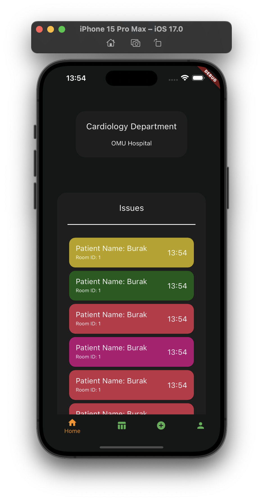
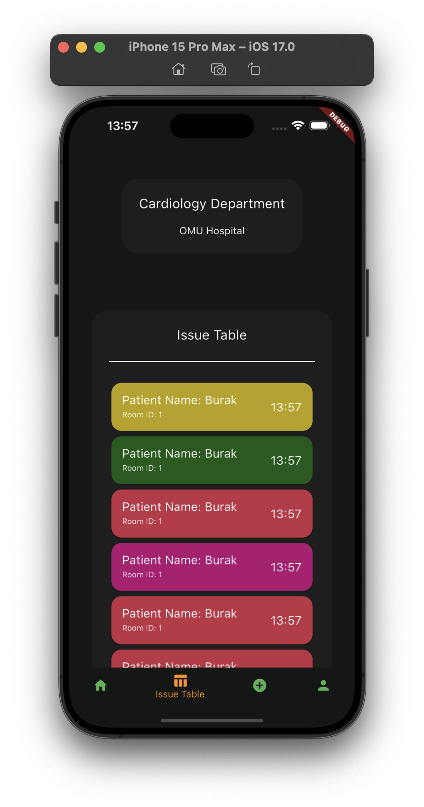
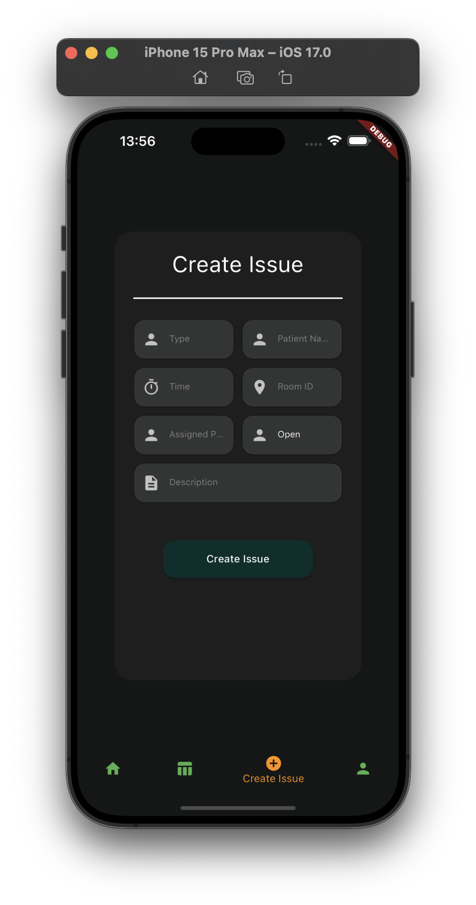
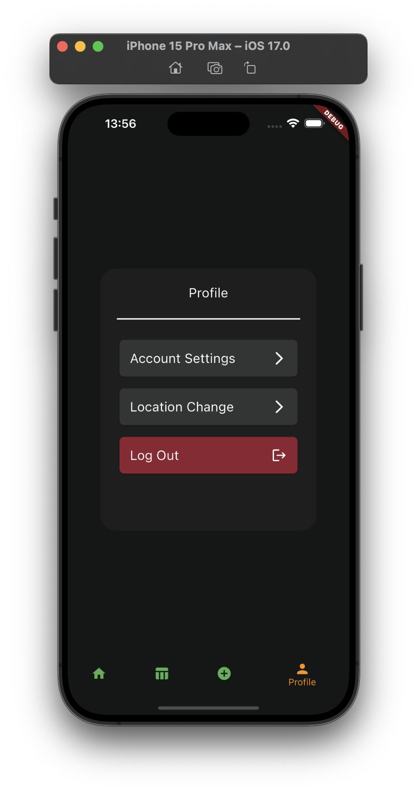
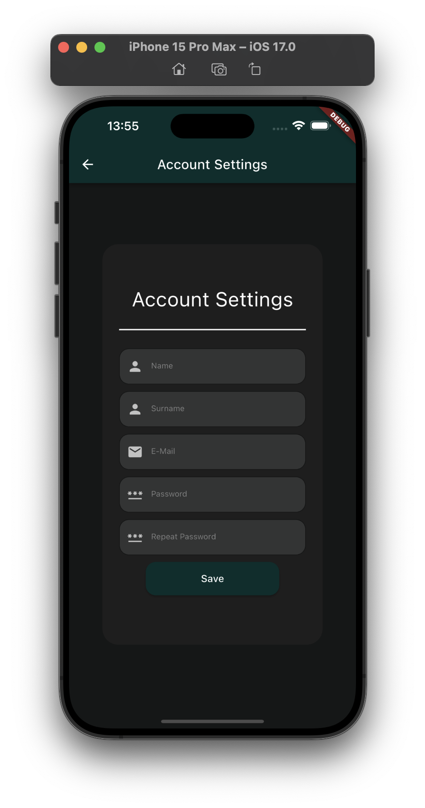
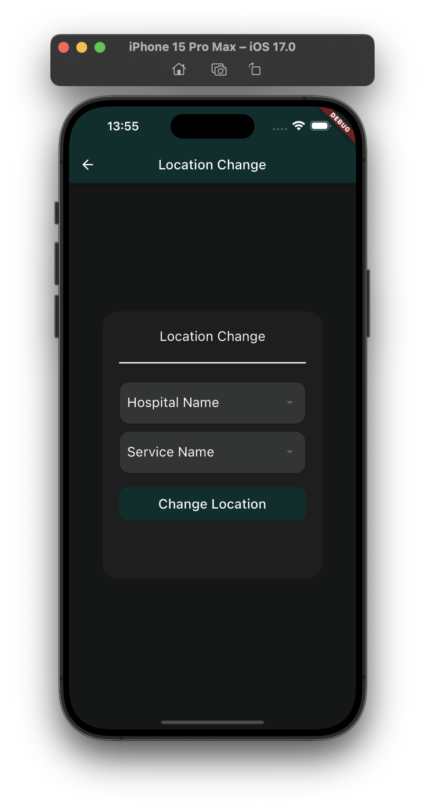

# hospital_assignment_app_mobile

## Description

This is a flutter mobile app for the hospital assignment app.

## Installation

### Flutter

- [Install Flutter](https://flutter.dev/docs/get-started/install)

# Run the app

There is two ways to run the app, either through the VSCode or through the command line.

## With VSCode

- Open the project in VSCode
- Open the command palette (Ctrl+Shift+P) or (Cmd+Shift+P)
- Run `Flutter: Select Device` and select the device you want to run on

## With command line

### Chrome

- Open the project in VSCode
- Open the terminal (Ctrl+Shift+\`) or (Cmd+Shift+\`)
- Run `flutter run`
- Select the Chrome 

### Android Emulator

Before you can run the app on the Android Emulator you need to have the emulator installed and running.

- Open the project in VSCode
- Open the terminal (Ctrl+Shift+\`) or (Cmd+Shift+\`)
- Run `flutter run`
- Select the Android Emulator

### iOS Simulator

Before you can run the app on the iOS Simulator 
- You need to have Xcode installed
- You need to have the simulator installed
- You need to have the simulator running

Run the app
- Open the project in VSCode
- Open the terminal (Ctrl+Shift+\`) or (Cmd+Shift+\`)
- Run `flutter run`
- Select the iOS Simulator

### Android

Before you can run the app on the Android device
- Enable USB debugging on your device
- Connect your device to your development machine with a USB cable

Run the app
- Open the project in VSCode
- Open the terminal (Ctrl+Shift+\`) or (Cmd+Shift+\`)
- Run `flutter run`
- Select the Android device

### iOS

Before you can run the app on the iOS device
- Mac only
- You need to have a valid Apple Developer account
- You need to have Xcode installed
- You need to have the device connected to your development machine

Run the app
- Open the project in VSCode
- Open the terminal (Ctrl+Shift+\`) or (Cmd+Shift+\`)
- Run `flutter run`
- Select the iOS device

### MacOS

Before you can run the app on the MacOS device
- Mac only
- You need to have Xcode installed

Run the app
- Open the project in VSCode
- Open the terminal (Ctrl+Shift+\`) or (Cmd+Shift+\`)
- Run `flutter run`
- Select the MacOS device

# Screens

## Login

### Description

This is the login screen where the user can login to the app.

### Photo

## Register

### Description

This is the register screen where the user can register to the app.

### Photo

## Home

### Description

This is the home screen where the user can see the list of assign to the user.

### Photo

## Issue Table

### Description

This is the issue table screen where the user can see the list of assigned hospital services in a card view.

### Photo

## Issue Details

### Description

This is the issue details screen where the user can see the details of the issue.

### Photo

## Create Issue

### Description

This is the create issue screen where the user can create a new issue.

### Photo

## Profile

### Description

This is the profile screen where the user change
- Profile details
- Hospital and department
- Logout

### Photo

## Edit Account

### Description

This is the edit profile screen where the user can edit account details.

### Photo

## Change Location

### Description

This is the change location screen where the user can change the hospital and department.

### Photo

